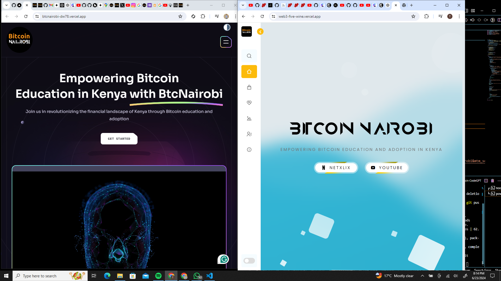

Bitcoin Nairobi project This is a shortcut 
<<<<<<< HEAD

img="";

=======
>>>>>>> b2e3e48c9a41d7cbb89725c059fedc618391d26b

img="";
- Vite
- React.js
- Tailwind CSS


```bash
git clone [https://github.com/DeenRamah/btcnairobi]
cd brainwave
```

**Installation**

Install the project dependencies using npm:

```bash
npm install
```

**Running the Project**

```bash
npm run dev
```

Open [http://localhost:5173](http://localhost:5173) in your browser to view the project.
